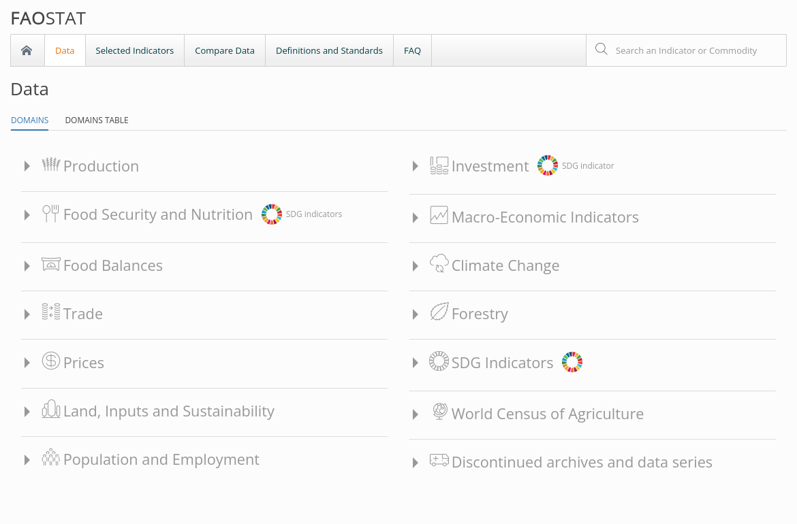

```{r setup, include=FALSE}
knitr::opts_chunk$set(cache = TRUE, message = FALSE, warning = FALSE)
```

```{r libraries, include=FALSE, message=FALSE, warning=FALSE}
library(tibble)
library(readr)
library(tidyr)
library(dplyr)
library(knitr)
library(geojsonsf)
library(sf)
library(leaflet)
library(mapview)
library(viridis)
```

# Data

## FAOSTAT

Tutti i dataset di partenza sono stati ottenuti dal sito della [FAO](https://www.fao.org/faostat/en/#data), un'organizzazione ONU che si occupa di cibo e agricoltura.

L'organizzazione è responsabile dei dati raccolti nei paesi membri delle nazioni unite e si occupa anche della loro validazione e diffusione.


# Balance of Trade

```{r BoTMap, echo=FALSE}
# building a df for the map
foodBoT <- read_csv("./data/FoodBalanceSheets_E_All_Data.csv")
foodBoT <- foodBoT %>%
  # selecting only the columns we need
  select(Area, Item, Element, Y2017, Y2018, Y2019) %>%
  # filtering export and import
  filter(Element == "Export Quantity" | Element == "Import Quantity") %>%
  # grouping so that we get can get one entry per state after using pivot_wider
  group_by(Area, Element) %>%
  summarize(Quantity = sum(Y2017, Y2018, Y2019, na.rm=TRUE)/3)
foodBoT <- pivot_wider(foodBoT, names_from = Element, values_from = Quantity) %>%
  mutate(`Balance of Trade` = `Export Quantity` - `Import Quantity`) %>%
  select(Area, `Balance of Trade`)

# normalization
minBoT <- min(foodBoT$`Balance of Trade`)
maxBoT <- max(foodBoT$`Balance of Trade`)
foodBoT <- mutate(foodBoT, `BoTNorm` =
                    (`Balance of Trade` - minBoT) / (maxBoT - minBoT))

# importing geographic data
borders <- geojson_sf("./data/countries.geojson")

# aligning column names
foodBoT <- rename(foodBoT, Country = Area)
bordersTemp <- rename(borders, Country = ADMIN) %>% select(Country)

# fixing country name mismatches
# let's find conflicts
countriesToFix <- anti_join(foodBoT, bordersTemp)
# fixing
foodBoTClean <- foodBoT
foodBoTClean[foodBoTClean == "Bahamas"] <- "The Bahamas"
foodBoTClean[foodBoTClean == "Bolivia (Plurinational State of)"] <- "Bolivia"
foodBoTClean[foodBoTClean == "China, Hong Kong SAR"] <- "Hong Kong S.A.R."
foodBoTClean[foodBoTClean == "China, Macao SAR"] <- "Macao S.A.R"
# removing aggregate entry for China
foodBoTClean = foodBoTClean[-39,]
foodBoTClean[foodBoTClean == "China, mainland"] <- "China"
foodBoTClean[foodBoTClean == "China, Taiwan Province of"] <- "Taiwan"
foodBoTClean[foodBoTClean == "Cabo Verde"] <- "Cape Verde"
foodBoTClean[foodBoTClean == "Congo"] <- "Republic of Congo"
foodBoTClean[foodBoTClean == "Cote d'Ivoire"] <- "Ivory Coast"
foodBoTClean[foodBoTClean == "Czechia"] <- "Czech Republic"
foodBoTClean[foodBoTClean == "Democratic People's Republic of Korea"] <- "North Korea"
foodBoTClean[foodBoTClean == "Eswatini"] <- "Swaziland"
foodBoTClean[foodBoTClean == "Guinea-Bissau"] <- "Guinea Bissau"
foodBoTClean[foodBoTClean == "Iran (Islamic Republic of)"] <- "Iran"
foodBoTClean[foodBoTClean == "Lao People's Democratic Republic"] <- "Laos"
foodBoTClean[foodBoTClean == "Micronesia"] <- "Federated States of Micronesia"
foodBoTClean[foodBoTClean == "Netherlands Antilles (former)"] <- "Curaçao" # 0
foodBoTClean[foodBoTClean == "North Macedonia"] <- "Macedonia"
foodBoTClean[foodBoTClean == "Republic of Korea"] <- "South Korea"
foodBoTClean[foodBoTClean == "Republic of Moldova"] <- "Moldova"
foodBoTClean[foodBoTClean == "Russian Federation"] <- "Russia"
foodBoTClean[foodBoTClean == "Serbia"] <- "Republic of Serbia"
# removing entry with no data for former Sudan
foodBoTClean = foodBoTClean[-185,]
foodBoTClean[foodBoTClean == "Syrian Arab Republic"] <- "Syria"
foodBoTClean[foodBoTClean == "Timor-Leste"] <- "East Timor"
foodBoTClean[foodBoTClean == "United Kingdom of Great Britain and Northern Ireland"] <- "United Kingdom"
foodBoTClean[foodBoTClean == "Venezuela (Bolivarian Republic of)"] <- "Venezuela"
foodBoTClean[foodBoTClean == "Viet Nam"] <- "Vietnam"

# left outer join between our df and the geographic data
borders <- left_join(borders, foodBoTClean, by = c("ADMIN" = "Country"))

# setting the palette
pal <- colorBin("viridis", borders$`BoTNorm`)

# making labels
labels <- sprintf("<strong>%s</strong><br/>%g K MT", borders$ADMIN, borders$`Balance of Trade`) %>%
  lapply(htmltools::HTML) # TODO main export/import and associated partners

# entries for custom legend
legendLabels <- tibble(
  "- 300,000", "- 240,000", "- 180,000", "- 120,000", "- 60,000", "0",  "+ 75,000", "+ 150,000", "+ 225,000", "+ 300,000"
  )

# building the map
map <- leaflet(borders , options = leafletOptions(minZoom = 2), width = "100%") %>%
  addTiles() %>%
  setView(15, 20, 2) %>%
  addPolygons(
    data = borders, 
    color = '#ffffff', 
    weight = 1, 
    opacity = 0.5, 
    fillColor = ~pal(BoTNorm), 
    fillOpacity = 0.7, 
    highlight = highlightOptions(weight = 5), 
    label = labels
    ) %>%
  addLegend("bottomright", pal = pal, values = ~BoTNorm, title = "BoT (K MT)", opacity = 1, labFormat = 
              function(type, cuts, p) {paste0(legendLabels)}
  )

```

## La mappa mondiale del BoT

```{r echo=FALSE}
map 
```
